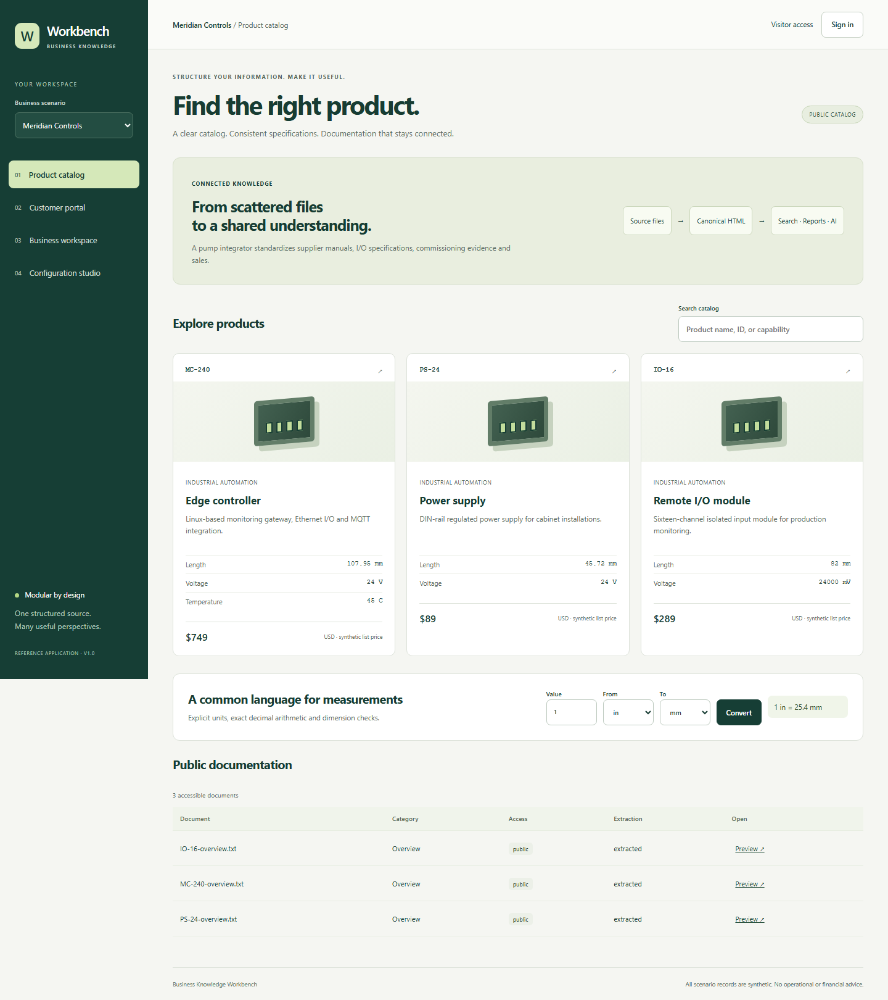

# Business Knowledge Workbench

[](https://github.com/JasonStys/business-knowledge-workbench/actions/workflows/ci.yml) [](https://github.com/JasonStys/business-knowledge-workbench/actions/workflows/codeql.yml)

A configurable business website and installable progressive web app that turns scattered documentation and data into searchable, traceable knowledge. Four views share one server-enforced permission model: a public product catalog, customer portal, employee workspace, and admin configuration studio.



This is a working, bounded reference application—not a universal document reader or a production compliance product. The original source is retained, uncertain extraction is labeled, and AI never gets write access. All demonstration businesses, products, customers, prices and performance figures are invented.

## What works

- Import **15 extensions**: TXT, Markdown, HTML/HTM, CSV/TSV, JSON, XML, DOCX, XLSX, PDF, PNG, JPG/JPEG and WebP. Supported structures and limitations are explicit in the [format matrix](docs/formats.md).
- Convert to **canonical HTML first**, then export HTML, structured JSON, Markdown, CSV tables, DOCX or PDF. Preserve document blocks, source hashes, template revisions, original files and normalization evidence.
- Normalize explicit length, mass, temperature, pressure, voltage and energy measurements using Decimal arithmetic and dimension validation. For example, `4.25 in → 107.95 mm` and `104 F → 40 C`.
- Search, filter by category, sort and combine documents in an ordered internal-only evidence pack. Customer and organization boundaries are enforced before retrieval, export and AI context assembly.
- Store sources, document structures, products, mapped sales rows, sessions, settings and audit events in SQLite. Import sales atomically using configurable column aliases; repeated sources cannot duplicate sales.
- View historical revenue, units sold, an accessible chart/table and a three-month baseline projection with an explicitly approximate prediction band. Download exact-cent reporting JSON.
- Add products and account-scoped inventory, change branding, document section order, target units, sales mappings, account labels and feature switches without changing the UI skeleton.
- Connect a hosted or local **OpenAI-compatible** model endpoint, or implement a trusted Python adapter for a custom model/agent. Image analysis is an explicit request; model responses and citations are checked and labeled unverified. The offline default is an honest extractive reference adapter, **not** an LLM or vision model.
- Install the same responsive app on supported desktop/mobile browsers. The service worker never caches private records or API responses. Offline navigation explains the connection requirement.

## Run locally

Requires Node 24 and Python 3.12–3.14. Commands below run from the repository root.

```powershell
python -m venv .venv
.venv\Scripts\Activate.ps1
python -m pip install -r requirements.lock -e .
npm ci --ignore-scripts
npm run build
$env:KB_DEMO = "1"
python -m uvicorn server.app:app --host 127.0.0.1 --port 8000
```

Open **http://127.0.0.1:8000**. On Linux/macOS, activate with `source .venv/bin/activate` and start with `KB_DEMO=1 python -m uvicorn server.app:app --host 127.0.0.1 --port 8000`.

Demo accounts: `customer` (north), `customer-south`, `employee`, `admin`. The demo-only password is `workbench-demo`. Select a scenario before signing in. Changing scenarios invalidates the current session. Never expose demo mode to real business data.

Alternatively, `docker compose up --build --wait` runs the local-only demo in a non-root, resource-limited container. The Docker daemon must be running. Normal mode creates no demo users or sales; see [operations](docs/operations.md) to provision a clean workspace.

For frontend development, run the API plus `npm run dev`; Vite proxies `/api` to port 8000. Rebuild before serving the complete app from Python.

## Try realistic workflows

1. Browse **Meridian Controls**, an industrial automation supplier: controllers, remote I/O, power supplies, supplier specifications and commissioning evidence. Search `MC-240` and inspect unit provenance.
2. Sign in as employee. Import `examples/commissioning-pack.docx` or `controller-performance.pdf`. Preview extracted tables, figures and equation evidence; read the fidelity warnings. Export the canonical result to another format.
3. Import `examples/industrial-sales.csv` with **Import sales rows into reporting** selected. The next report includes those rows; reimport does not multiply them.
4. Select two documents, choose a compilation title, and combine them. The result is internal-only even when its sources were public or customer-facing.
5. Sign in as admin, change a unit target or section order, and reimport a source. Historical conversions retain their original revision. Enable AI deliberately, then ask a source-grounded question from the business workspace.
6. Switch to **Solstice Energy Supply** (equipment dimensions, storage and sales) or **Atlas Laboratory Supply** (calibration records and customer equipment). See [scenario walkthroughs](docs/scenarios.md).

## Verify

```bash
python -m ruff check server scripts tests/python
python -m ruff format --check server scripts tests/python
npm run format:check
python scripts/code_index.py --check
python scripts/file_catalog.py --check
python -m pytest -q
python scripts/benchmark.py
npm run build
npx playwright install chromium firefox webkit
npm test
npm audit --audit-level=high
python -m pip_audit -r requirements.lock
```

Linux browser CI installs system packages with `npx playwright install --with-deps`. `scripts/verify.sh` runs all gates after environment activation. [Validation evidence](docs/validation.md) distinguishes local tests, CI checks, simulated model contracts and untested physical-device installation. Actions run on pushes, PRs, manual dispatch and weekly schedules, publishing raw reports even on failure.

## Structure and language choices

| Files | Responsibility |
| --- | --- |
| `web/main.ts`, `web/types.ts`, `web/style.css`, `index.html` | Typed browser state/API interactions, four views, responsive accessible design and semantic markup. |
| `server/app.py`, `server/models.py` | Same-origin API, sessions, CSRF, authorization, bounded imports and validated contracts/configuration. |
| `server/conversion.py`, `server/worker.py`, `server/units.py` | Python's document ecosystem, isolated parsing, semantic blocks, safe HTML and exact unit conversion. |
| `server/schema.sql`, `server/store.py` | SQL integrity/indexes, scoped persistence, synthetic seeding and salted password hashes. |
| `server/analytics.py`, `server/exports.py`, `server/ai.py` | Explainable reports, HTML-derived exports and replaceable read-only model adapters. |
| `server/manage.py` | Operator-only clean workspace/user provisioning and SQLite backup. |
| `public/` | App manifest, icons, privacy-preserving service worker and offline view. |
| `examples/` | Synthetic rich sources, mapped sales, mixed measurements and a trusted custom-adapter example. |
| `tests/python/`, `tests/browser/` | Conversion/API/security/model contracts and browser workflows/accessibility/PWA regression checks. |
| `scripts/` | Reproducible fixture builders, performance checks, compiler/AST code inventories and Bash verification. |
| `vite.config.ts`, `tsconfig.json`, `playwright.config.ts`, `package*.json` | Frontend build, static checking, browser matrix and exact JavaScript dependency lock. |
| `pyproject.toml`, `requirements.lock` | Python metadata, lint/test configuration and pinned dependencies. |
| `Dockerfile`, `compose.yaml`, `.dockerignore` | Portable, single-origin, non-root packaging with local demo resource limits. |
| `.github/workflows/`, `.gitignore` | CI/security checks and exclusions for credentials, runtime data and transient evidence. |
| `docs/`, `SECURITY.md`, `CONTRIBUTING.md`, `LICENSE` | Design decisions, API/extension/runbooks, validation, code/file inventories and project policies. |

TypeScript fits browser interaction and typed contracts; Python fits heterogeneous extraction and model integration; SQL provides transactional integrity; HTML/CSS provide portable, inspectable output; JavaScript handles the browser service worker and document fixture tools; Bash coordinates verification. Extra languages are not inserted into hot paths without a demonstrated need.

Every authored code file has a descriptive header and generated exact symbol/variable line map. Function/class contracts explain purpose and parameter use. [The complete code index](docs/code-index.md) records local bindings; regenerate it after code changes. [The file catalog](docs/file-catalog.md) summarizes every tracked file; regenerate with `python scripts/file_catalog.py` after adding files. [Architecture and ADR](docs/architecture.md) explain complexity, performance, safety and alternatives. [Extension guide](docs/extensions.md) shows how to add formats, data schemas and models.

## Important boundaries

"Any file" and "any operating system" are extension goals, not honest guarantees a single reader can make. Unsupported formats are rejected, not guessed. OCR, vector-chart interpretation, formula semantics and precise page-layout reconstruction are not guaranteed. The original file remains the authority. Native store packages, signing, real cloud deployment, SSO, antivirus/CDR and production-scale storage are deployment extensions. See the [support matrix](docs/formats.md) and [release checklist](docs/operations.md) before using real data.
